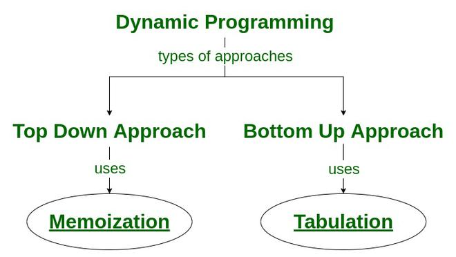

# Dynamic Programming
- DP is a useful technique for optimization problems, those problems that seek the maximum or minimum solution given certain constraints, because it looks through all possible sub-problems and never recomputes the solution to any sub-problem.
- It is both a mathematical optimization technique. - **wikipedia**
- Dynamic programming refers to a problem-solving approach, in which we precompute and store simpler, similar subproblems, in order to build up the solution to a complex problem. - **birilliant**
- Dynamic programming amounts to breaking down an optimization problem into simpler sub-problems, and storing the solution to each sub-problem so that each sub-problem is only solved once. - **freecodecamp**

## Approach

## Memoization
- No re-computation
- In computing, memoization or memoisation is an optimization technique used primarily to speed up computer programs by storing the results of expensive function calls and returning the cached result when the same inputs occur again. - **wikipedia**
- Transform the results of a function into something to remember
- Storing solutions of sub-problems, when a solution of them is requested then can be given directly from the storage instead of calculating it again.

## References
- https://www.freecodecamp.org/news/demystifying-dynamic-programming-3efafb8d4296/
